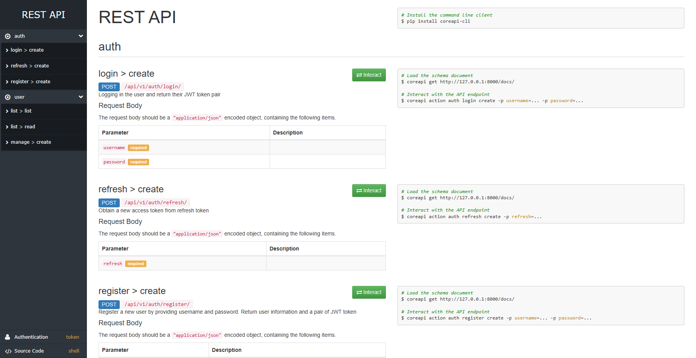
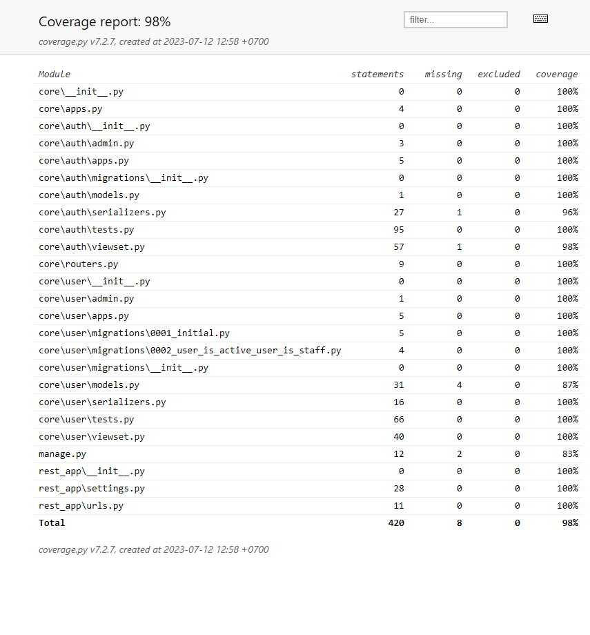

# Django Rest Framework - Auth

Web application with authentication using django rest framework (DRF) with features:

1. `Login`, an endpoint for user authentication using username and password
2. `Register`, an endpoint for user to register their account
3. `Refresh Token`, an endpoint to update access token using refresh token for security purpose
4. `List User`, an endpoint for retrieveing list and details of users
5. `Add User`, an endpoint for register new user after login for authorized user (superuser or admin)
6. `Remove User`, an endpoint for removeing their own account from database with validate username and password

## Installation
1. Make sure to have local environment with python version 3.8.13, i.e using conda:
```
conda create -n {env_name} python==3.8.13 
```
2. Activate your environment
3. Install dependencies:
```
pip install -r requirements.txt
```
4. Do database migration
```
python manage.py migrate
```
5. Create superuser:
```
python manage.py createsuperuser
```
6. Collect static files: 
```
python manage.py collectstatic --noinput
```
7. Run the server: 
```
python manage.py runserver
```
8. Server is running at `http://localhost:8000`, and redirect to this following docs page for api testing



## Unit Test

```
python manage.py test
```
This application has a coverage up to `98%` in all module, according to the following report

